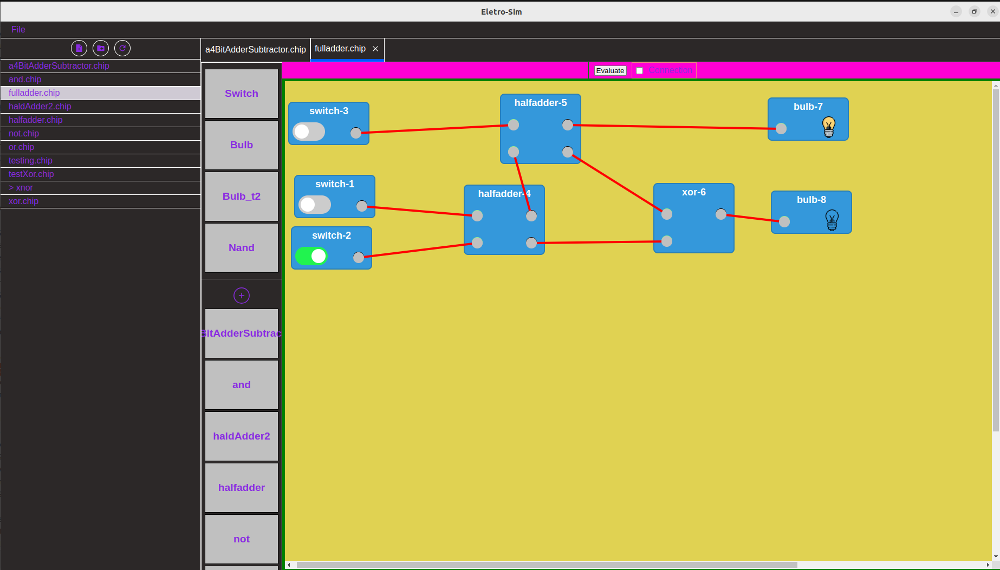

# **Electro-Sim** ⚡

### **Combinational Gates Simulator**

Electro-Sim is a desktop application that allows users to visually create, connect, and simulate combinational logic circuits. Users can drag and drop logic gates, establish connections, and evaluate circuit behavior in real-time.

## 🚀 **Project Status**

🔧 This project is currently under development. The goal is to build and simulate an **8-bit computer** within the simulator.

## 💻 **Installation & Usage**

Coming soon...

## 🖼️ **Demo**

